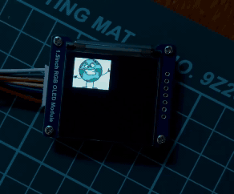

## SSD1351 SPI Driver for Zephyr RTOS

This is a Zephyr RTOS driver for the **Solomon SSD1351** OLED display (using SPI). It supports multiple pixel formats, custom grayscale for better display quality, and flicker-free operation.

## Features

- SPI interface support for communication with the SSD1351 display.
- Supports PIXEL_FORMAT_RGB565, PIXEL_FORMAT_BGR565, and PIXEL_FORMAT_RGB888 (RGB888 is converted to RGB666 due to the SSD1351's limitations).
- Custom grayscale table applied for improved display quality.
- Flicker-free operation (including capturing the display with a phone camera, due to customized IC clock settings).
- Compatible with the LVGL graphics library.
- Rotation support.
- Compatible with [Waveshare 1.5-inch RGB OLED Display Module](https://www.waveshare.com/1.5inch-rgb-oled-module.htm).

## Adding Driver To Zephyr Project

### CMakeLists.txt

To include the driver in your Zephyr project, specify its path in the CMakeLists.txt file as follows:

```
set(ZEPHYR_EXTRA_MODULES
    ${CMAKE_CURRENT_SOURCE_DIR}/drivers/ssd1351-zephyr-driver  # Change it to your path
)
```

### Configuration in prj.conf

Add the following configuration options to your prj.conf to enable SPI and the SSD1351 driver:

```
CONFIG_SPI=y
CONFIG_DISPLAY=y
CONFIG_SSD1351=y
```

### Example SPI Configuration in Device Tree

Ensure that the SPI interface is properly configured in the Device Tree. Below is an example configuration for the SPI3 interface:

```
#include <zephyr/dt-bindings/display/panel.h>

&spi3 {
    compatible = "nordic,nrf-spim";
    status = "okay";
    pinctrl-0 = <&spi3_default>;
    pinctrl-1 = <&spi3_sleep>;
    pinctrl-names = "default", "sleep";
    cs-gpios = <&gpio0 20 (GPIO_ACTIVE_LOW | GPIO_PULL_UP)>;

    ssd1351: ssd1351@0 {
        status = "okay";
        compatible = "solomon,ssd1351";
        spi-max-frequency = <24000000>;
        reg = <0>;
        reset-gpios = <&gpio0 6 (GPIO_ACTIVE_LOW | GPIO_PULL_UP)>;
        dc-gpios = <&gpio0 24 GPIO_ACTIVE_HIGH>;
        width = <128>;
        height = <128>;
        rotation = <0>;
        pixel-format = <PANEL_PIXEL_FORMAT_RGB_888>;
    };
};
```

The following pixel formats are supported:

```
PANEL_PIXEL_FORMAT_RGB565
PANEL_PIXEL_FORMAT_BGR565
PANEL_PIXEL_FORMAT_RGB888
``` 

Note: RGB888 is converted to RGB666 due to the SSD1351's hardware limitations, as it doesn't support full 888 color depth.

## Tested Hardware

This driver has been developed and tested on the Waveshare 1.5-inch RGB OLED Display Module. You can find more information and purchase the module here.



## Contributing

Pull requests and issues are always welcome! Feel free to contribute to make this project better.